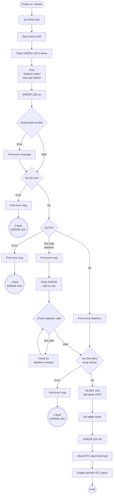
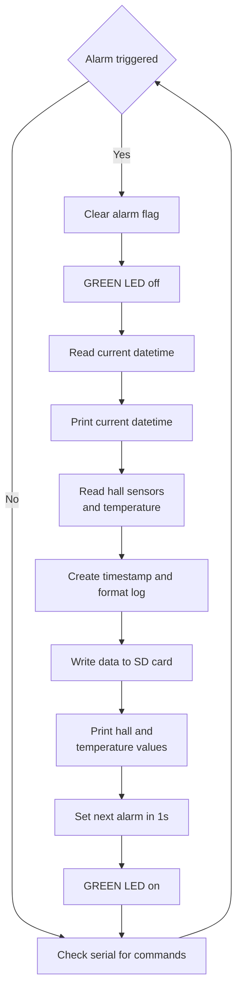

This document describes the logical flow of the firmware, divided into two main parts: the initialization sequence and the main execution loop.

---

## Setup Function

```mermaid
flowchart TD
    Start([Power on / Reset])
    InitGPIO["Init GPIO Pins"]
    SerialInit["Start Serial USB"]
    FlashLED["Flash GREEN LED 3 times"]
    PrintReady["Print <br> #quot;Arduino ready#quot; <br> and wait 500ms"]
    StartSequence[ERROR LED on]
    GetSerialNumber{Read serial number}
    SerialNumberError[Print error message]

    InitializeSD{"Init SD card"}
    SDCardErrorMsg["Print error msg"]
    SDCardError((("2 flash <br> ERROR LED")))

    InitializeRTC{"Init RTC"}
    RTCNotDetectedMsg["Print error msg"]
    RTCNotDetected((("1 flash <br> ERROR LED")))
    RTCLostpwrMsg["Print error msg"]
    RTCNoLostpwr["Print actual datetime"]

    RTCCheckDatetime{"Check datetime valid"}
    RTCDateTimeInvalid["Flash ERROR <br> LED at 1Hz"]
    RTCCheckfForCMD["Check for <br> datetime comand"]

    InitializeTemp{"Init One-Wire <br> temp sensor"}
    TempSensorErrorMsg["Print error msg"]
    TempSensorError((("3 flash <br> ERROR LED")))

    InitializeHall["Init ADC and <br> hall sleep GPIO"]
    InitializeLogfile["Init logfile name"]
    EndSequence[ERROR LED off]

    AttachRTC["Attach RTC alarm interrupt"]
    EnableRTC["Enable periodic RTC alarm"]

    %% diagram
    Start --> InitGPIO --> SerialInit --> FlashLED --> PrintReady --> StartSequence --> GetSerialNumber
    GetSerialNumber -- Valid --> InitializeSD
    GetSerialNumber -- Error --> SerialNumberError --> InitializeSD

    InitializeSD -- Ok ---> InitializeRTC
    %%InitializeSD -- Error --> SDCardErrorMsg --> SDCardError --> SDCardError
    InitializeSD -- Error --> SDCardErrorMsg --> SDCardError

    %%InitializeRTC -- Error --> RTCNotDetectedMsg --> RTCNotDetected --> RTCNotDetected
    InitializeRTC -- Error --> RTCNotDetectedMsg --> RTCNotDetected
    InitializeRTC -- Not valid <br> datetime --> RTCLostpwrMsg --> RTCDateTimeInvalid --> RTCCheckDatetime
    InitializeRTC -- Ok --> RTCNoLostpwr --> InitializeTemp
    RTCCheckDatetime -- Not valid --> RTCCheckfForCMD --> RTCCheckDatetime
    RTCCheckDatetime -- Valid --> InitializeTemp

    InitializeTemp -- Error --> TempSensorErrorMsg --> TempSensorError
    InitializeTemp -- Ok --> InitializeHall

    InitializeHall --> InitializeLogfile --> EndSequence

    EndSequence --> AttachRTC --> EnableRTC --> loop((Loop))
```

## Main Loop

```mermaid
flowchart TD
    CheckAlarm{Alarm triggered}
    ClearFlag["Clear alarm flag"]
    StartMeasure[GREEN LED off]
    GetTime["Read current datetime"]
    PrintTime["Print current datetime"]
    ReadSensors["Read hall sensors <br> and temperature"]
    CreateLog["Create timestamp and format log"]
    WriteSD["Write data to SD card"]
    PrintSensors["Print hall and <br> temperature values"]
    SetNewAlarm["Set next alarm in 1s"]
    EndMeasure[GREEN LED on]
    SerialCmd["Check serial for commands"]

    %%subgraph Loop
    CheckAlarm -- Yes ---> ClearFlag
    CheckAlarm -- No --> SerialCmd --> CheckAlarm
    ClearFlag --> StartMeasure --> GetTime --> PrintTime --> ReadSensors --> CreateLog --> WriteSD --> PrintSensors --> SetNewAlarm --> EndMeasure --> SerialCmd
    %%end
```
